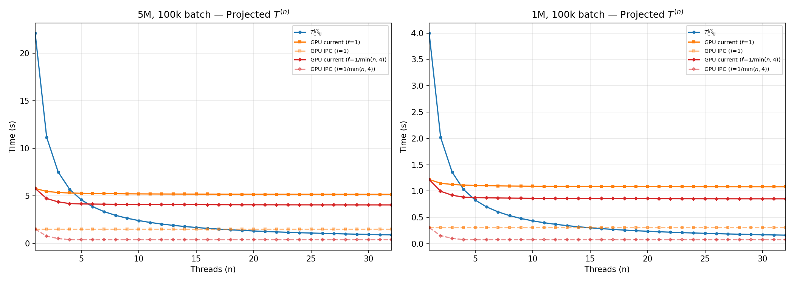

# Python Transfer Profiles

## Theoretical Analysis

### Preliminaries

Let $T_c$ be UDF compute time.  

Let $T_s$ be round-trip serialization time.
- 1 round trip: `writeArrowIPCArrowChunk + readArrowIPCChunkToArrowTable`.

Let $T_p$ be round-trip PCIe transfer time. We decompose $T_p$ into two hops:
- $T_{p,\mathrm{jvm}}$: JVM-side — `convertCudfToArrowTable + convertArrowTableToCudf`
- $T_{p,\mathrm{py}}$: Python-side — `cudf.Series(_) + _.to_pandas()`

Let $T^{(n)}$ be wall-clock time of the entire UDF op (including data transfer) with $n$ threads.

We consider a machine with $n$ CPU cores, 1 PCIe bus, and 1 GPU.

### Single Thread

#### Formulas

Consider using only 1 thread/task on the machine.

##### CPU

$$
T_{\mathrm{CPU}}^{(1)} = T_c^{\mathrm{CPU}} + T_s + T_{p,\mathrm{jvm}}
$$

##### GPU

$$
T_{\mathrm{GPU}}^{(1)} = T_c^{\mathrm{GPU}} + T_s + T_{p,\mathrm{jvm}} + T_{p,\mathrm{py}}
$$

### Multiple Threads

#### Scaling

We assume that scaling to $n$ threads results in:
- $T_s$: **linear scaling**, since serialization is pure CPU.
- $T_c$:
    - **linear scaling** for $T_c^{\mathrm{CPU}}$, since this is CPU compute.
    - **sublinear scaling** for $T_c^{\mathrm{GPU}}$, since kernels may be serialized (depends on memory intensity of UDF).
- $T_{p,\mathrm{jvm}}$, $T_{p,\mathrm{py}}$: **fixed**, assuming the PCIe bus is saturated.

For a simplified model, we assume the components are additive (disregarding pipelining across threads). Thus, the model is a conservative upper bound. 

#### Formulas

Consider $n$ threads/tasks.

##### CPU

$$
T_{\mathrm{CPU}}^{(n)} = \frac{1}{n}T_c^{\mathrm{CPU}} + \frac{1}{n} T_s + T_{p,\mathrm{jvm}}
$$

As $n \rightarrow \infty$:

$$
T_{\mathrm{CPU}}^{(\infty)} = T_{p,\mathrm{jvm}}
$$

##### GPU

Assume GPU compute scales with some $\frac{1}{n} \le f(n) \le 1$.  

$$
T_{\mathrm{GPU}}^{(n)} = f(n)\, T_c^{\mathrm{GPU}} + \frac{1}{n} T_s + T_{p,\mathrm{jvm}} + T_{p,\mathrm{py}}
$$

As $n \rightarrow \infty$:

$$
T_{\mathrm{GPU}}^{(\infty)} = f(\infty)\, T_c^{\mathrm{GPU}} + T_{p,\mathrm{jvm}} + T_{p,\mathrm{py}}
$$

## Empirical Analysis

We consider the [ascii_ignore](experiments/ascii_ignore/src/ascii_ignore_impl.py) UDF and its [GPU implementation](experiments/ascii_ignore/src/ascii_ignore_gpu_impl.py) as a case study.

### Measuring $T^{(1)}$, $T_c$, and $T_{p,\mathrm{py}}$

The results below measure running the UDF in a Spark job with **1 thread, 1 task**. 

| Experiment          | UDF Impl | Op Time (s) | Compute (s) | % Compute | Py H2D (s) | Py D2H (s) | Overhead (s) | Actual Speedup | Compute Speedup |
| ------------------- | -------- | ----------- | ----------- | --------- | ----------- | ----------- | ------------ | -------------- | --------------- |
| 1M rows, 10k batch  | GPU      | 3.50        | 1.020       | 29.15%    | 0.570       | 0.136       | 1.774        | 1.34           | 4.61            |
|                     | CPU      | 4.70        | 3.631       | 77.26%    |             |             |              |                |                 |
| 1M rows, 100k batch | GPU      | 2.80        | 0.306       | 10.93%    | 0.566       | 0.167       | 1.761        | 1.79           | 16.33           |
|                     | CPU      | 5.00        | 3.815       | 76.30%    |             |             |              |                |                 |
| 5M rows, 10k batch  | GPU      | 13.50       | 4.976       | 36.86%    | 2.521       | 0.616       | 5.387        | 1.67           | 4.54            |
|                     | CPU      | 22.60       | 18.155      | 80.33%    |             |             |              |                |                 |
| 5M rows, 100k batch | GPU      | 10.90       | 1.485       | 13.62%    | 2.670       | 0.775       | 5.970        | 2.44           | 17.92           |
|                     | CPU      | 26.60       | 21.251      | 79.89%    |             |             |              |                |                 |

Where:

- $T^{(1)}$ = Op time
- $T_c$ = Compute
- $T_{p,\mathrm{py}}$ = Py H2D + Py D2H

### Measuring $T_s$ and $T_{p,\mathrm{jvm}}$

The results below run a pure Java microbenchmark, exercising the JNI calls invoked by `GpuArrowWriter` / `GpuArrowReader`.  
All times are medians of 5 measured runs on the **input** data (275 MB at 1M, 1377 MB at 5M).

| Experiment  | D2H (s) | IPC ser (s) | IPC deser (s) | H2D (s) | $T_{p,\mathrm{jvm}}$ (s) | $T_s$ (s) | Round-trip (s) |
| ----------- | ------- | ----------- | ------------- | ------- | ------------------------ | ---------- | -------------- |
| 5M, 100k    | 0.100   | 0.492       | 0.147         | 0.096   | 0.196                    | 0.639      | 0.836          |
| 5M, 10k     | 0.129   | 0.487       | 0.124         | 0.117   | 0.246      | 0.611      | 0.858          |
| 1M, 100k    | 0.020   | 0.113       | 0.027         | 0.019   | 0.039      | 0.141      | 0.179          |
| 1M, 10k     | 0.026   | 0.111       | 0.024         | 0.023   | 0.049      | 0.135      | 0.183          |

Where:

- D2H = `convertCudfToArrowTable`
- IPC ser = `writeArrowIPCArrowChunk`
- IPC deser = `readArrowIPCChunkToArrowTable`
- H2D = `convertArrowTableToCudf`
- $T_{p,\mathrm{jvm}} = \text{D2H} + \text{H2D}$
- $T_s = \text{IPC ser} + \text{IPC deser}$

### Extrapolation to $n$ Threads

#### Measured Parameters

| Parameter                          | 5M, 100k | 5M, 10k | 1M, 100k | 1M, 10k |
| ---------------------------------- | -------- | ------- | -------- | ------- |
| $T_c^{\mathrm{CPU}}$ (s)          | 21.251   | 18.155  | 3.815    | 3.631   |
| $T_c^{\mathrm{GPU}}$ (s)          | 1.485    | 4.976   | 0.306    | 1.020   |
| $T_s$ (s)                         | 0.639    | 0.611   | 0.141    | 0.135   |
| $T_{p,\mathrm{jvm}}$ (s)          | 0.196    | 0.246   | 0.039    | 0.049   |
| $T_{p,\mathrm{py}}$ (s)           | 3.445    | 3.137   | 0.733    | 0.706   |

Note: The model at $n=1$ underestimates the observed Spark op times, possibly due to additional effects like socket I/O, cuInit, Spark's internal Pandas to Arrow conversion, etc. 

#### Projected $T^{(n)}$ — 5M rows, 100k batch

We conservatively assume $f(n) = 1$, i.e., GPU compute is fully serialized.

Using the equations from above:
$$
T_{\mathrm{CPU}}^{(n)} = \frac{1}{n}T_c^{\mathrm{CPU}} + \frac{1}{n} T_s + T_{p,\mathrm{jvm}}
$$
$$
T_{\mathrm{GPU}}^{(n)} = f(n)\, T_c^{\mathrm{GPU}} + \frac{1}{n} T_s + T_{p,\mathrm{jvm}} + T_{p,\mathrm{py}}
$$

| $n$ | $T_\mathrm{CPU}^{(n)}$ | $T_\mathrm{GPU}^{(n)}$ | GPU / CPU |
| --- | ----------------------- | ----------------------- | --------- |
| 1   | 22.09                   | 5.77                    | 3.8×      |
| 4   | 5.67                    | 5.29                    | 1.1×      |
| 8   | 2.93                    | 5.21                    | 0.56×     |
| 16  | 1.56                    | 5.17                    | 0.30×     |
| 32  | 0.88                    | 5.15                    | 0.17×     |

**Crossover at $n \approx 4$**: $T_\mathrm{GPU}$ barely decreases because the fixed overhead $T_{p,\mathrm{jvm}} + T_{p,\mathrm{py}} = 3.64$ s dominates. Beyond $\sim\!4$ threads, the GPU UDF is *slower* than CPU.

#### With CUDA IPC

We assume for simplicity that CUDA IPC eliminates transfer and serialization, i.e.: $T_s, T_{p,\mathrm{jvm}}, T_{p,\mathrm{py}} \to 0$.

Thus the CUDA IPC model is: $T_\mathrm{GPU,IPC}^{(n)} = f(n)\, T_c^{\mathrm{GPU}}$

We consider two models for $f(n)$:

- **$f(n) = 1$**: GPU compute is fully serialized (a single kernel saturates memory bandwidth).
- **$f(n) = 1/\min(n, 4)$**: GPU scales linearly up to 4 concurrent kernels, then saturates.

**$f(n) = 1$**:

| $n$ | $T_\mathrm{CPU}^{(n)}$ | $T_\mathrm{GPU}^{(n)}$ | $T_\mathrm{GPU,IPC}^{(n)}$ | IPC Speedup |
| --- | ----------------------- | ----------------------- | --------------------------- | ----------- |
| 1   | 22.09                   | 5.77                    | 1.49                        | 3.9×        |
| 4   | 5.67                    | 5.29                    | 1.49                        | 3.6×        |
| 8   | 2.93                    | 5.21                    | 1.49                        | 3.5×        |
| 16  | 1.56                    | 5.17                    | 1.49                        | 3.5×        |
| 32  | 0.88                    | 5.15                    | 1.49                        | 3.5×        |

**$f(n) = 1/\min(n, 4)$**:

| $n$ | $T_\mathrm{CPU}^{(n)}$ | $T_\mathrm{GPU}^{(n)}$ | $T_\mathrm{GPU,IPC}^{(n)}$ | IPC Speedup |
| --- | ----------------------- | ----------------------- | --------------------------- | ----------- |
| 1   | 22.09                   | 5.77                    | 1.49                        | 3.9×        |
| 4   | 5.67                    | 4.17                    | 0.37                        | 11.2×       |
| 8   | 2.93                    | 4.09                    | 0.37                        | 11.0×       |
| 16  | 1.56                    | 4.05                    | 0.37                        | 10.9×       |
| 32  | 0.88                    | 4.03                    | 0.37                        | 10.9×       |

